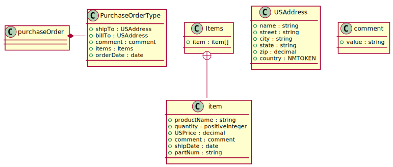

PlantUML: plantuml
==================

Generate `PlantUML <https://plantuml.com/class-diagram>`_ class diagram

.. literalinclude:: ../examples/primer.pu

Which is translated to this nice svg

.. hint::

    Then above output was generating by running the following command

        ``xsdata docs/examples/primer.xsd --package docs.examples --renderer plantuml --print``

    The output was converted to svg with the plantUML cli tool

        ``plantuml docs/examples/primer.pu -tsvg``
