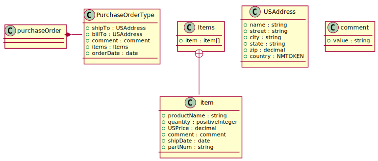

PlantUML
========

Generate `PlantUML <https://plantuml.com/class-diagram>`_ class diagram

.. literalinclude:: /../tests/fixtures/primer/order.pu

Which is translated to this nice svg

.. hint::

    Then above output was generating by running the following command

    ``xsdata tests/fixtures/primer/order.xsd --package order --output plantuml --print``

    The output was converted to svg with the plantUML cli tool

    ``plantuml tests/fixtures/primer/order.pu -tsvg``
